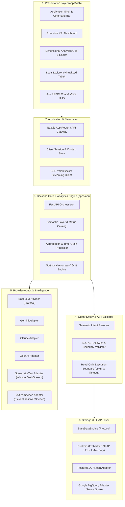

# System Architecture & Layered Contracts

> **PRISM — Business Intelligence Platform**  
> Layered, Provider-Agnostic, High-Performance Architecture

---

## 1. High-Level Architecture Diagram



---

## 2. Layer Definitions & Responsibilities

### 1. Presentation Layer (`apps/web`)
- Built with **Next.js (App Router)**, **React**, **TypeScript**, and **Tailwind CSS**.
- Follows the *PRISM Design System* (dark mode data terminal, high data density, micro-sparklines).
- Contains zero business aggregation formulas or SQL construction; strictly renders structured payloads and dispatches semantic user actions.

### 2. Application & Context Layer
- Manages client-side query state, filters (time ranges, regions, channels), and multi-turn conversational session history.
- Handles server-sent event (SSE) streaming for real-time text and chart generation.

### 3. Analytics & Semantic Engine (`apps/api/src/analytics`)
- Houses the canonical definitions for all metrics (Revenue, AOV, Conversion, LTV, Retention).
- Performs time-grain bucketing (hourly, daily, weekly, monthly, quarterly) and comparative delta computations ($YoY$, $MoM$, $DoD$).
- Prepares normalized analytical frames for chart rendering.

### 4. Query Safety & AST Sandbox (`apps/api/src/security`)
- Inspects generated or parameterized queries before touching any database.
- Enforces strict rules:
  - `SELECT`-only; rejects any `INSERT`, `UPDATE`, `DELETE`, `DROP`, `ALTER`, `TRUNCATE`, `EXEC`.
  - Schema allowlist validation on table and column identifiers.
  - Mandatory `LIMIT` injection (default 100, max 1000).
  - Strict query execution timeouts (3000ms max).

### 5. Provider-Agnostic Intelligence Layer (`apps/api/src/providers/llm`)
- Clean interface abstraction (`BaseLLMProvider` Protocol):
  ```python
  class BaseLLMProvider(Protocol):
      async def generate_intent(self, query: str, context: ConversationContext) -> SemanticIntent: ...
      async def generate_summary(self, data_summary: MetricSummary) -> NarrativeInsight: ...
  ```
- Easily swappable between Gemini, Claude, and OpenAI without touching downstream components.

### 6. Agnostic Data Engine Layer (`apps/api/src/providers/data`)
- Clean abstraction (`BaseDataEngine` Protocol):
  ```python
  class BaseDataEngine(Protocol):
      async def execute_query(self, query: SafeSQLQuery) -> QueryResult: ...
      async def get_schema_metadata(self) -> SchemaMetadata: ...
  ```
- Supports local in-memory/embedded execution (DuckDB), relational persistence (PostgreSQL / Neon), and scalable enterprise warehouses (BigQuery).
