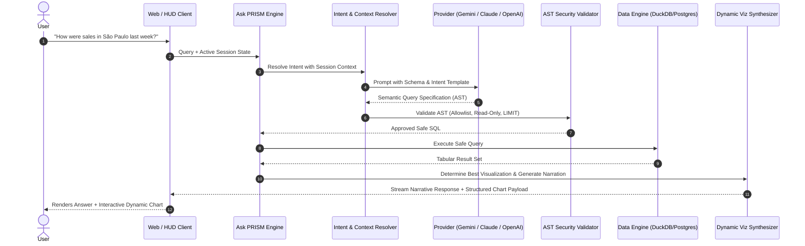

# Ask PRISM — Conversational BI & NL-to-SQL Engine

> **PRISM — Business Intelligence Platform**  
> Conversational Intelligence, Multi-Turn Context Continuity, Safe Query Synthesis, and Visual Narration

---

## 1. Pipeline Architecture

---

## 2. Multi-Turn Context Retention

Ask PRISM maintains a conversational session state machine to enable natural analytical follow-ups:

### Example Conversational Progression:
1. **Turn 1**: *"Show total revenue for the last 30 days."*  
   - **Active State**: `{ metric: "revenue", time_range: "last_30_days", group_by: "day" }`
2. **Turn 2**: *"Compare with the previous month."*  
   - **Inherited**: `metric: "revenue"`, `group_by: "day"`  
   - **Modified State**: `{ metric: "revenue", time_range: "last_30_days", comparison: "previous_month" }`
3. **Turn 3**: *"Filter only São Paulo."*  
   - **Inherited**: Metrics, time range, comparison  
   - **Modified State**: `{ ..., filters: [{ dimension: "region", value: "São Paulo" }] }`
4. **Turn 4**: *"Why did it drop in the second week?"*  
   - **Trigger**: Anomaly Drill-down engine across subcategories and marketing spend.

---

## 3. Dynamic Visualization Selection Engine

The system maps the shape of the analytical result set to the optimal visual archetype:

| Result Shape | Target Visual Archetype |
| :--- | :--- |
| **Single Scalar / Metric Delta** | Single KPI Stat Card + Mini Sparkline |
| **Time Series (Single Metric)** | Area Chart with gradient fill & baseline |
| **Time Series (Multiple Series / Comparison)** | Dual-line chart with comparative dashed strokes |
| **Categorical Breakdown (< 7 categories)** | Donut Chart or Horizontal Ranked Bar Chart |
| **Categorical Breakdown (>= 7 categories)** | Ranked Horizontal Bar Chart or Sorted Table |
| **Multi-Dimensional Matrix** | Heatmap or Grouped Bar Chart |
| **Tabular Records (Entities)** | High-density Virtualized Table |
