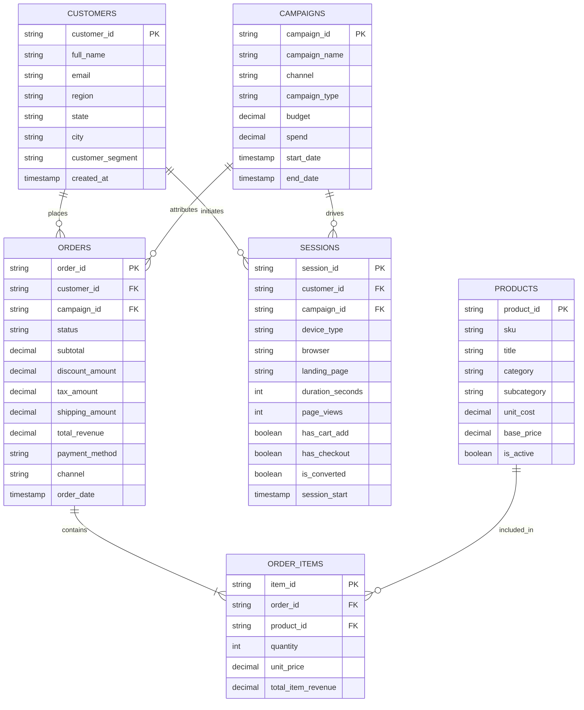

# E-Commerce Conceptual Data Model & Metric Catalog

> **PRISM — Business Intelligence Platform**  
> Foundational Schema, Dimensions, and Canonical Metric Formulations

---

## 1. Entity-Relationship Model (Conceptual)

---

## 2. Core Dimensions

| Dimension | Description | Cardinality / Examples |
| :--- | :--- | :--- |
| **Time** | `order_date`, `session_start` | Hourly, Daily, Weekly, Monthly, Quarterly, Yearly |
| **Customer** | `customer_segment`, `customer_id` | VIP, Regular, At-Risk, Churned, New |
| **Product & Category**| `category`, `subcategory`, `product_id`| Electronics, Apparel, Home & Living, Beauty |
| **Geography / Region**| `region`, `state`, `city` | Southeast (SP, RJ, MG), South (RS, SC, PR), Northeast, etc. |
| **Channel / Source** | `channel` | Organic Search, Paid Ads, Social, Email, Direct, Affiliate |
| **Device & Client** | `device_type`, `browser` | Mobile (iOS, Android), Desktop, Tablet |
| **Campaign** | `campaign_name`, `campaign_type` | Black Friday, Summer Launch, Retargeting |

---

## 3. Canonical Metric Formulations (Semantic Definitions)

### A. Revenue & Monetization
- **Gross Revenue**:
  $$\text{Gross Revenue} = \sum (\text{item\_price} \times \text{quantity})$$
- **Net Revenue**:
  $$\text{Net Revenue} = \sum (\text{total\_revenue} - \text{discount\_amount} - \text{refunds})$$
- **Average Order Value (AOV)**:
  $$\text{AOV} = \frac{\text{Net Revenue}}{\text{Total Orders Completed}}$$

### B. Conversion & Funnel
- **Overall Conversion Rate**:
  $$\text{CR} = \frac{\text{Total Converted Sessions}}{\text{Total Sessions}} \times 100$$
- **Cart Abandonment Rate**:
  $$\text{Cart Abandonment} = \left(1 - \frac{\text{Sessions with Completed Order}}{\text{Sessions with Cart Add}}\right) \times 100$$

### C. Customer Acquisition & Retention
- **New vs. Returning Ratio**:
  $$\text{New Customer Ratio} = \frac{\text{Orders from Customers with First Order in Period}}{\text{Total Orders}}$$
- **Customer Lifetime Value (LTV - 90d / 360d)**:
  $$\text{LTV} = \text{Average Revenue per Customer} \times \text{Average Purchase Frequency}$$

---

## 4. Query Efficiency & Rollup Strategy

To guarantee millisecond dashboard responsiveness:
1. **Raw Layer**: Granular transactional tables (`orders`, `order_items`, `sessions`).
2. **Aggregated Daily Marts (`marts.daily_sales_rollup`)**: Pre-aggregated metrics grouped by `date`, `category`, `region`, `channel`, `device_type`.
3. **Semantic Layer Abstraction**: Queries from Ask PRISM and the Executive View query the rollup marts first, falling back to granular tables only when drill-down predicates require item-level specifics.
