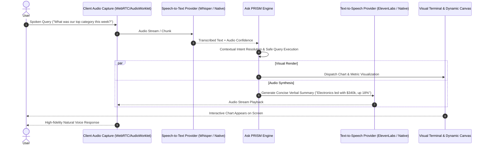

# PRISM Voice System Architecture

> **PRISM — Business Intelligence Platform**  
> Hands-Free Ambient Voice Analytics: Speech-to-Text, Conversational Routing, Dynamic Narration, and Text-to-Speech

---

## 1. Voice Interaction Pipeline

---

## 2. Voice-Specific UX & Latency Constraints

1. **Concise Spoken Summaries**: The verbal response must be dense, succinct, and natural (1-2 sentences maximum). The user can read deep tables on screen while listening to the top-line takeaway.
2. **Visual & Audio Synchrony**: The UI updates the chart instantly the moment the query resolves, while audio playback begins streaming without blocking user interaction.
3. **Interruptibility**: The user must be able to speak at any point to interrupt the audio stream and initiate a follow-up query.
4. **Provider Agnosticism**: Voice adapters interface through standard audio streaming protocols (Web Audio API on client, streaming STT/TTS on backend).
